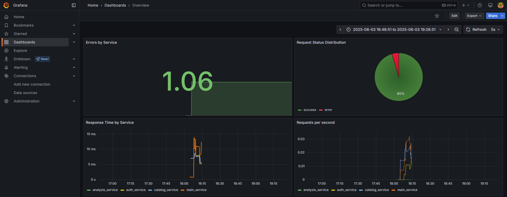
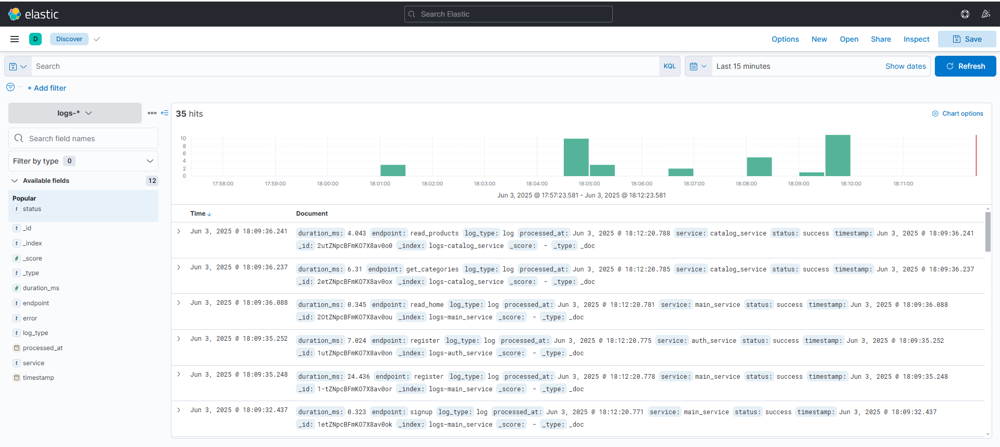
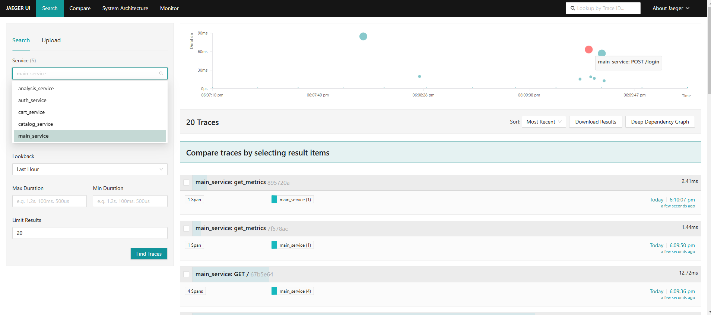

# YMarket - Высоконагруженная Платформа Электронной Коммерции

## Обзор Проекта
YMarket - это высоконагруженная платформа электронной коммерции, построенная на микросервисной архитектуре. Система разработана для обработки высоких нагрузок и предоставления аналитики пользовательского поведения и бизнес-метрик в реальном времени.

## Демонстрация проекта

[Смотреть демо (mp4)](images/demo.mp4)

<details>
  <summary>Встроенное видео (может не поддерживаться на всех платформах)</summary>

  <video src="images/demo.mp4" controls width="700">
    Ваш браузер не поддерживает видео.
  </video>

</details>

### Ключевые Возможности
- Высокопроизводительный API-сервис на базе FastAPI
- Обработка данных в реальном времени с использованием Kafka
- Эффективное хранение и поиск данных с PostgreSQL и Elasticsearch
- Комплексная система мониторинга и трейсинга
- Аналитика и бизнес-интеллект в реальном времени

## Архитектура

Платформа состоит из нескольких микросервисов:

- **Auth Service**: Управление аутентификацией и авторизацией пользователей
- **Catalog Service**: Управление каталогом товаров и функционал поиска
- **Cart Service**: Операции с корзиной покупок
- **Payment Service**: Обработка платежей и транзакций
- **Main Service**: Основная бизнес-логика и API-шлюз
- **Analysis Service**: Обработка и анализ данных о поведении пользователей

## Мониторинг и Аналитика

Платформа реализует комплексную систему мониторинга и аналитики:

### Grafana
Мониторинг системных метрик, показателей производительности и бизнес-аналитики в реальном времени.



### Kibana
Визуализация и анализ системных логов.



### Jaeger
Распределенная система трейсинга для мониторинга и отладки микросервисов.



## Технический Стек

- **Бэкенд**: FastAPI, Python
- **Брокер сообщений**: Apache Kafka
- **Базы данных**: 
  - PostgreSQL (основное хранилище данных)
  - Elasticsearch (поиск и аналитика)
- **Мониторинг**: 
  - Prometheus (сбор метрик)
  - Grafana (визуализация)
  - Jaeger (распределенный трейсинг)
  - Kibana (анализ логов)

## Ключевые Особенности

- Высокопроизводительный API-сервис для операций электронной коммерции
- Потоковая обработка данных в реальном времени
- Эффективное взаимодействие между сервисами
- Анализ поведения пользователей в реальном времени
- Комплексный мониторинг и наблюдаемость
- Масштабируемая микросервисная архитектура

## Начало Работы

### Требования
- Docker и Docker Compose
- Python 3.8+

### Установка

1. Клонируйте репозиторий:
```bash
git clone https://github.com/yourusername/YMarket.git
cd YMarket
```

2. Запустите сервисы с помощью Docker Compose:
```bash
docker-compose up -d
```

3. Доступ к сервисам:
- Основной API: http://localhost:8000
- Grafana: http://localhost:3000
- Kibana: http://localhost:5601
- Jaeger: http://localhost:16686
